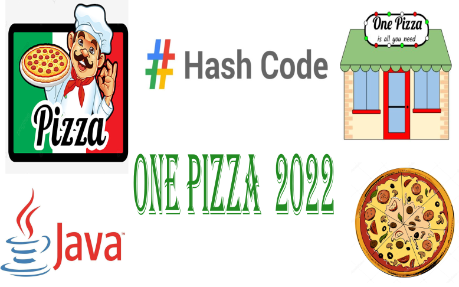

# Solving-One-Pizza-Practice-Problem-Hashcode-2022-Using-Java

creating a java programing oriented object for practice round hashcode 2022 problem with the simulated score board

# which approach did i used ?
i used the first agorithm to solve the input (a_an_example.in | b_basic.in)

the algorithm is :
1- Taking all the ingredient customers ( liked Ingredient and disliked Ingredient )
2- Removing any ingredient from choosed ingredient list which is inside desliked  list ingredient customer

i solve the reste inputs(c_coarse.in | d_difficult.in | e_elaborate.in) by the second algorithm

the algorithm is :
1- Reordering customers list according to the disliked ingredient list (accending order)
2- If  two disliked ingredient list customers has the same size , we will take the customer with the shortes liked list ingredient.
3- Taking all the ingredient liked list customers while there is no any disliked ingredient inside the taken list
# The details explanation video in the link below

